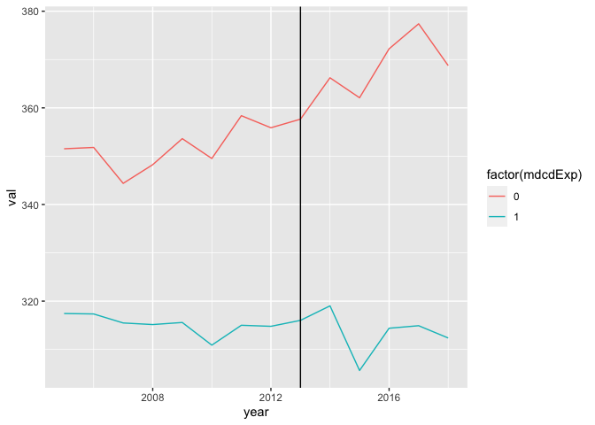
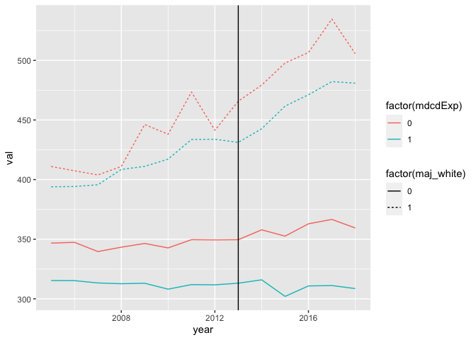
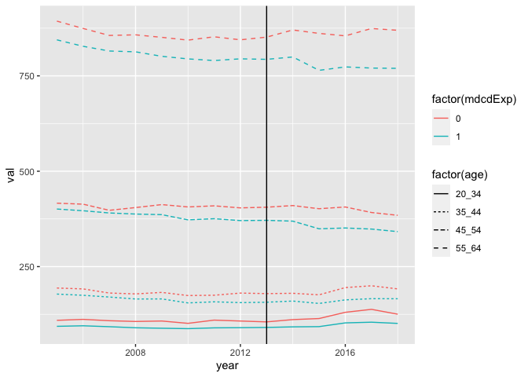
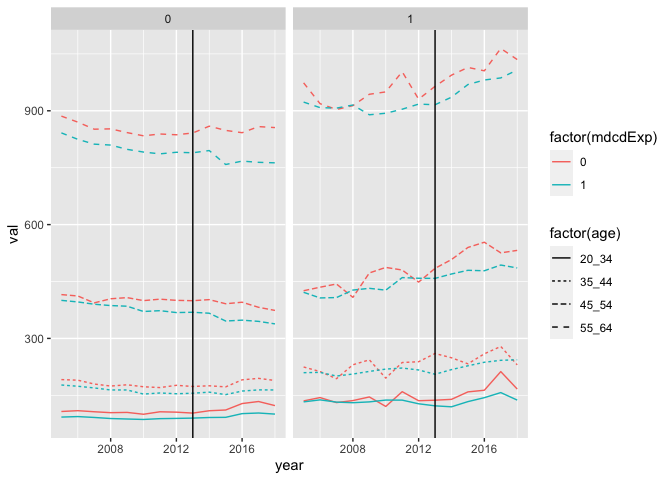
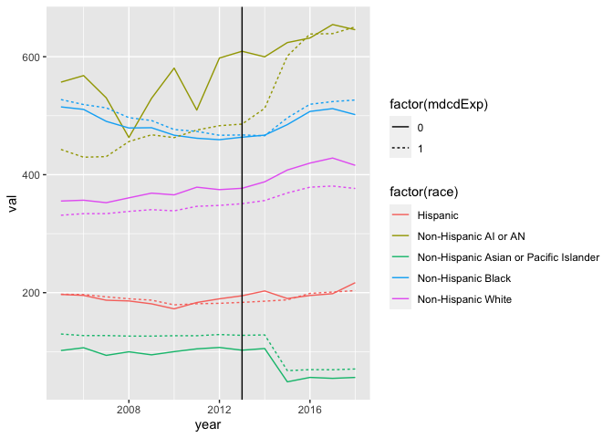
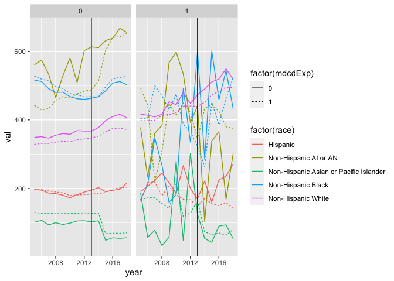

Figures showing trends in mortality over time
================
manncz
2022-07-21

Load required data

``` r
load("../../../compute1/data/pop_2005_14.Rdata")
load("../../../compute1/data/all_det_mort_2005_18.Rdata")
load("../data/temp/supermajority.white.xwalk.Rdata")
load("../data/mod.dat.Rdata")
load("../data/temp/pop.2015.19.Rdata")
```

Create an xwalk for the treatment assignment and weights based on
matches

``` r
treat.xwalk <- mod.dat %>%
  dplyr::select(FIPS, mdcdExp, matches.final) %>%
  group_by(matches.final, mdcdExp) %>%
  mutate(n = n()) %>%
  group_by(matches.final) %>%
  mutate(n_treat = sum(mdcdExp)) %>%
  ungroup() %>%
  mutate(w = 1/n * n_treat)
```

Re-categorize some of the race categories in the newer population data

``` r
pop.2015.18 <- pop.2015.19 %>% 
  ungroup() %>% 
  select(-stateName, -cntyName) %>%
  mutate(race = case_when(race == "Hispanic Other" ~ "Hispanic",
                          race %in% c("Non-Hispanic Hawaiian or Pacific Islander", "Non-Hispanic Asian") ~ "Non-Hispanic Asian or Pacific Islander",
                          TRUE ~race)) %>%
  filter(!(race %in% c("Total", "Other", "Non-Hispanic Other")) & year <= 2018) %>%
  group_by(FIPS, year, race, age) %>%
  summarize(pop = sum(pop)) %>%
  ungroup()
```

    ## `summarise()` has grouped output by 'FIPS', 'year', 'race'. You can override using the `.groups` argument.

Append the two population files

``` r
pop.dat <- pop_clean %>%
  ungroup() %>%
  mutate(FIPS = paste0(stateFIPS, cntyFIPS)) %>%
  select(-stateFIPS, -cntyFIPS) %>%
  rbind(pop.2015.18)
```

Check out that things look as expected

``` r
table(pop.dat$race)
```

    ## 
    ##                               Hispanic                  Non-Hispanic AI or AN 
    ##                                 175904                                 175904 
    ## Non-Hispanic Asian or Pacific Islander                     Non-Hispanic Black 
    ##                                 175904                                 175904 
    ##                     Non-Hispanic White 
    ##                                 175904

``` r
table(pop.dat$year)
```

    ## 
    ##  2005  2006  2007  2008  2009  2010  2011  2012  2013  2014  2015  2016  2017  2018 
    ## 62820 62820 62820 62820 62820 62820 62800 62800 62800 62840 62840 62840 62840 62840

``` r
table(pop.dat$age)
```

    ## 
    ##  20_34  35_44  45_54  55_64 
    ## 219880 219880 219880 219880

``` r
table(mort_det_0518$race_bridged)
```

    ## 
    ##              Hispanic Non-Hispanic AI or AN    Non-Hispanic Asian    Non-Hispanic Black    Non-Hispanic White 
    ##                 59140                 27487                 26454                 78814                160924

Rename one of the race categories in the mort data to match the pop data

``` r
mort <- mort_det_0518 %>%
  mutate(race = case_when(race_bridged == "Non-Hispanic Asian" ~ "Non-Hispanic Asian or Pacific Islander",
                          TRUE ~ race_bridged)) %>%
  select(-stateFIPS, -cntyFIPS, -race_bridged)
```

Merge on the mortality data and fill with 0s where there is population
data Merge on the treatment and supermajority white xwalks

``` r
plot.dat <- pop.dat %>%
  left_join(mort, by = c("FIPS", "year", "age", "race")) %>%
  mutate(across(starts_with("mort"), ~coalesce(.x, 0L))) %>%
  left_join(treat.xwalk, by = "FIPS") %>%
  left_join(maj.white.xwalk, by = "FIPS") %>%
  filter(!is.na(w))
```

### Final plotting data

Mortality and population counts by county and year

``` r
plot.dat.overall <- plot.dat %>%
  group_by(FIPS, mdcdExp, w, maj_white, year) %>%
  summarize(across(pop | starts_with("mort"), sum))
```

    ## `summarise()` has grouped output by 'FIPS', 'mdcdExp', 'w', 'maj_white'. You can override using the `.groups`
    ## argument.

``` r
mort.overall <- plot.dat.overall %>%
  ungroup() %>%
  mutate(across(pop | starts_with("mort"), ~.x*w)) %>%
  group_by(mdcdExp, year) %>%
  summarize(across(pop | starts_with("mort"), sum)) %>%
  mutate(across(starts_with("mort"), ~.x/pop*100000, .names = "{.col}_rate")) %>%
  pivot_longer(starts_with("mort"), names_to = "type", values_to = "val")
```

    ## `summarise()` has grouped output by 'mdcdExp'. You can override using the `.groups` argument.

``` r
mort.overall.smw <- plot.dat.overall %>%
  ungroup() %>%
  mutate(across(pop | starts_with("mort"), ~.x*w)) %>%
  group_by(mdcdExp, year, maj_white) %>%
  summarize(across(pop | starts_with("mort"), sum)) %>%
  mutate(across(starts_with("mort"), ~.x/pop*100000, .names = "{.col}_rate")) %>%
  pivot_longer(starts_with("mort"), names_to = "type", values_to = "val")
```

    ## `summarise()` has grouped output by 'mdcdExp', 'year'. You can override using the `.groups` argument.

Mortality and population counts by county, year, and race

``` r
plot.dat.race <-  plot.dat %>%
  group_by(FIPS, mdcdExp, w, maj_white, year, race) %>%
  summarize(across(pop | starts_with("mort"), sum))
```

    ## `summarise()` has grouped output by 'FIPS', 'mdcdExp', 'w', 'maj_white', 'year'. You can override using the
    ## `.groups` argument.

``` r
mort.race <- plot.dat.race %>%
  ungroup() %>%
  mutate(across(pop | starts_with("mort"), ~.x*w)) %>%
  group_by(mdcdExp, year,race) %>%
  summarize(across(pop | starts_with("mort"), sum)) %>%
  mutate(across(starts_with("mort"), ~.x/pop*100000, .names = "{.col}_rate")) %>%
  pivot_longer(starts_with("mort"), names_to = "type", values_to = "val")
```

    ## `summarise()` has grouped output by 'mdcdExp', 'year'. You can override using the `.groups` argument.

``` r
mort.race.smw <- plot.dat.race %>%
  ungroup() %>%
  mutate(across(pop | starts_with("mort"), ~.x*w)) %>%
  group_by(mdcdExp, year, maj_white,race) %>%
  summarize(across(pop | starts_with("mort"), sum)) %>%
  mutate(across(starts_with("mort"), ~.x/pop*100000, .names = "{.col}_rate")) %>%
  pivot_longer(starts_with("mort"), names_to = "type", values_to = "val")
```

    ## `summarise()` has grouped output by 'mdcdExp', 'year', 'maj_white'. You can override using the `.groups`
    ## argument.

Mortality and population counts by county, year, and age

``` r
plot.dat.age <- plot.dat %>%
  group_by(FIPS, mdcdExp, w, maj_white, year, age) %>%
  summarize(across(pop | starts_with("mort"), sum))
```

    ## `summarise()` has grouped output by 'FIPS', 'mdcdExp', 'w', 'maj_white', 'year'. You can override using the
    ## `.groups` argument.

``` r
mort.age <- plot.dat.age %>%
  ungroup() %>%
  mutate(across(pop | starts_with("mort"), ~.x*w)) %>%
  group_by(mdcdExp, year,age) %>%
  summarize(across(pop | starts_with("mort"), sum)) %>%
  mutate(across(starts_with("mort"), ~.x/pop*100000, .names = "{.col}_rate")) %>%
  pivot_longer(starts_with("mort"), names_to = "type", values_to = "val")
```

    ## `summarise()` has grouped output by 'mdcdExp', 'year'. You can override using the `.groups` argument.

``` r
mort.age.smw <- plot.dat.age %>%
  ungroup() %>%
  mutate(across(pop | starts_with("mort"), ~.x*w)) %>%
  group_by(mdcdExp, year, maj_white,age) %>%
  summarize(across(pop | starts_with("mort"), sum)) %>%
  mutate(across(starts_with("mort"), ~.x/pop*100000, .names = "{.col}_rate")) %>%
  pivot_longer(starts_with("mort"), names_to = "type", values_to = "val")
```

    ## `summarise()` has grouped output by 'mdcdExp', 'year', 'maj_white'. You can override using the `.groups`
    ## argument.

Overall Trends

``` r
g <- ggplot(data = mort.overall %>% filter(type == "mort_all_cause_rate"), 
            aes(x = year, y = val, color = factor(mdcdExp)))
g + geom_line() +geom_vline(xintercept = 2013)
```

<!-- -->

``` r
g <- ggplot(data = mort.overall.smw %>% filter(type == "mort_all_cause_rate"), 
            aes(x = year, y = val, color = factor(mdcdExp), linetype = factor(maj_white)))
g + geom_line() +geom_vline(xintercept = 2013)
```

<!-- -->

Trends by Age

``` r
g <- ggplot(data = mort.age%>% filter(type == "mort_all_cause_rate"), 
            aes(x = year, y = val, color = factor(mdcdExp), linetype = factor(age)))
g + geom_line() +geom_vline(xintercept = 2013)
```

<!-- -->

``` r
g <- ggplot(data = mort.age.smw%>% filter(type == "mort_all_cause_rate"), 
            aes(x = year, y = val, color = factor(mdcdExp), linetype = factor(age)))
g + geom_line() +geom_vline(xintercept = 2013) + facet_grid(~maj_white)
```

<!-- -->

Trends by Race

``` r
g <- ggplot(data = mort.race%>% filter(type == "mort_all_cause_rate"), 
            aes(x = year, y = val, linetype = factor(mdcdExp), color = factor(race)))
g + geom_line() +geom_vline(xintercept = 2013)
```

<!-- -->

``` r
g <- ggplot(data = mort.race.smw %>% filter(type == "mort_all_cause_rate"), 
            aes(x = year, y = val, linetype = factor(mdcdExp), color = factor(race)))
g + geom_line() +geom_vline(xintercept = 2013) + facet_grid(~maj_white)
```

<!-- -->
