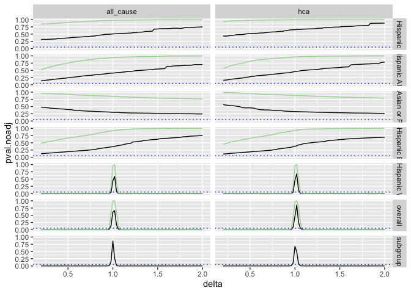

Placebo Tests
================
manncz
2022-08-05

Replace with “T” if want to re-run the interval estimation

``` r
int.est = F
```

## Data

First, pull in the data from compute 1 (the files paths work with CM’s
local setup)

``` r
path <- file.path("..","..","..", "compute1","data")

load(file.path(path,"out_mod_dat_2014.Rdata"))
load(file.path(path,"all_det_mort_65.Rdata"))
load(file.path(path, "pop_65.Rdata"))
```

List of variables to be included in each outcome model

``` r
load("../data/temp/mod.var.list.Rdata")
```

Datasets with calculated m (special population values)

``` r
load("../data/temp/overall.m.2014.Rdata")
load("../data/temp/m.by.race.2014.Rdata")
```

Form that includes all possible variables for outcome model

``` r
load("../data/temp/all_wonder_res.Rdata")
```

Supermajority white xwalk

``` r
load("../data/temp/supermajority.white.xwalk.Rdata")
```

Replace the model outcomes with the 65+ outcomes

``` r
mort_clean <- mort_det_65 %>%
  dplyr::select(-race) %>%
  rename(race = race_bridged) %>%
  mutate(race = case_when(race == "Non-Hispanic Asian" ~ "Non-Hispanic Asian or Pacific Islander",
                          TRUE~ race)) %>%
  group_by(FIPS, race, age) %>%
  summarize_all(sum) %>%
  ungroup()%>%
  select(-cntyFIPS, -stateFIPS)

mort.pop.65 <- pop_clean %>%
  filter(age == "65_74") %>%
  filter(year %in% 2013:2014) %>%
  pivot_wider(names_from = year, values_from = pop,
              names_glue = "{.value}_{year}",
              values_fill = 0) %>%
  mutate(FIPS = paste0(stateFIPS, cntyFIPS)) %>%
  filter(!(stateFIPS %in% c("02", "15")))%>%
  ungroup() %>%
  dplyr::select(FIPS, everything(), -stateFIPS, -cntyFIPS) %>%
  left_join(mort_clean, by = c("FIPS", "race", "age")) %>%
  mutate(across(contains("mort"), ~replace(., is.na(.), 0)))

dat.2014 <- mod_2014 %>%
  ungroup() %>%
  select(-cntyFIPS, -stateFIPS) %>%
  filter(trimmed == 0) %>%
  filter(age == "20_34") %>%
  mutate(age = "65_74") %>%
  select(-c(mort_HC_amenable_not_flu_2011:pop_2014)) %>%
  left_join(mort.pop.65, by = c("FIPS","race","age")) %>%
  rename(mort_HC_amenable_not_flu_l1= mort_HC_amenable_not_flu_2013,
         mort_HC_amenable_not_flu_l2= mort_HC_amenable_not_flu_2012,
         mort_all_cause_l1 = mort_all_cause_2013,
         mort_all_cause_l2 = mort_all_cause_2012) %>%
  left_join(maj.white.xwalk, by = "FIPS") %>%
  rename(treat = mdcdExp, pop = pop_2014, matches = matches.final, s = maj_white)
```

Need to remove the age groups from variable lists

``` r
names(var_list)
```

    ## [1] "all_cause" "hca"       "flu"       "opioid"

``` r
var_list_old <- var_list
for(l in names(var_list_old)){
  temp <- var_list_old[[l]]
  var_list[[l]] <- temp[!str_detect(temp, "age")]
  
}
```

Set up all of the things needed to apply the same function to different
outcomes

``` r
outcome_vars <- list(all_cause = "mort_all_cause_2014",
                     hca = "mort_HC_amenable_not_flu_2014",
                     flu = "mort_Flu_2014",
                     opioid = "mort_opioid_involved_2014")

m.dat.list <- list(all = overall_m)

for(r in levels(factor(m_by_race$race))){
  m.dat.list[[r]] <- m_by_race %>%
    filter(race == r) %>%
    ungroup() %>%
    dplyr::select(-race)
}

analyses <- names(var_list)
race_subgroup_analyses <- levels(factor(dat.2014$race))
```

formula

``` r
vars <- dat.2014%>%
  ungroup() %>% 
  select(race, mort_HC_amenable_not_flu_l1, mort_HC_amenable_not_flu_l2,
         mort_all_cause_l1, mort_all_cause_l2, white_race:calc_multi_house, log_adult_w_a_cnt) %>%
  colnames()
form <- formula(paste0(" ~ ", paste(vars, collapse="+")))
```

No reporting lag

``` r
dat.2014$lag = 0
```

generate confidence intervals just for all cause and HCA

``` r
if(int.est){
  start.time <- Sys.time()
  int.dat.placebo <- gen_conf_int_dat(delta.min = .2, delta.max = 2, delta.by = .02, analys = analyses[1:2])
  end.time <- Sys.time()
  
  end.time - start.time
  save(int.dat.placebo, file = "../data/temp/interval.dat.placebo.Rdata")
}

load("../data/temp/interval.dat.placebo.Rdata")
ggplot(dat = int.dat.placebo, aes(x = delta))+
  geom_line(aes(y = pval.noadj)) + 
  geom_line(aes(y = pval.maxtadj), color = "#a1d99b") +
  geom_abline(intercept = .05, slope = 0, color = "blue", linetype = "dotted") +
  facet_grid(subgroup ~ analysis)
```

<!-- -->
