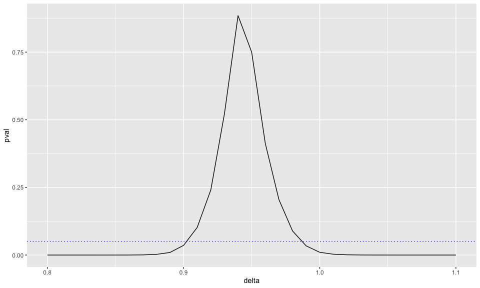

Further Investigating Subgroup Effects
================
manncz
2023-09-15

## Data

First, pull in the data from compute 1 (the files paths work with CM’s
local setup)

``` r
path <- file.path("..","..","..", "compute1","data")

load(file.path(path,"out_mod_dat_2014.Rdata"))
```

List of variables to be included in each outcome model

``` r
load("../data/temp/mod.var.list.Rdata")
```

Datasets with calculated m (special population values)

``` r
load("../data/temp/overall.m.2014.Rdata")
load("../data/temp/m.by.race.2014.Rdata")
```

Form that includes all possible variables for outcome model

``` r
load("../data/temp/all_wonder_res.Rdata")
```

Supermajority white xwalk

``` r
load("../data/temp/supermajority.white.xwalk.Rdata")
```

## Simple regression with original matches

``` r
#========================================================================================#
#                                 SIMPLE REGRESSION                                      #
#========================================================================================#

form <- paste("mort_dmf ~ treat+", paste(vars.wonder2,collapse = "+"))

mod <- glm(formula(form), data = dat.2014.wonder %>% filter(s == 1), weights = log_adult_w_a_cnt,
           family = poisson)
summary(mod)
```

    ## 
    ## Call:
    ## glm(formula = formula(form), family = poisson, data = dat.2014.wonder %>% 
    ##     filter(s == 1), weights = log_adult_w_a_cnt)
    ## 
    ## Deviance Residuals: 
    ##     Min       1Q   Median       3Q      Max  
    ## -7.9491  -2.1729  -0.1734   1.8277   7.5874  
    ## 
    ## Coefficients:
    ##                           Estimate Std. Error z value Pr(>|z|)    
    ## (Intercept)              1.110e-01  1.322e+00   0.084 0.933105    
    ## treat                   -6.305e-02  6.082e-03 -10.365  < 2e-16 ***
    ## mort_all_cause_l1        3.720e-04  3.052e-04   1.219 0.222926    
    ## mort_all_cause_l2       -4.806e-04  2.571e-04  -1.870 0.061536 .  
    ## white_race              -5.070e-02  1.278e-02  -3.967 7.29e-05 ***
    ## latino                  -1.510e-03  9.792e-04  -1.542 0.123052    
    ## male                    -2.608e-02  6.051e-03  -4.309 1.64e-05 ***
    ## mortAC_20_34             2.405e-03  4.944e-04   4.865 1.14e-06 ***
    ## mortAC_35_44             2.050e-03  3.877e-04   5.288 1.24e-07 ***
    ## mortAC_45_54             1.727e-03  3.335e-04   5.179 2.24e-07 ***
    ## mortAC_55_64             1.334e-03  2.280e-04   5.851 4.89e-09 ***
    ## mortAC_20_64            -8.362e-04  5.160e-04  -1.621 0.105120    
    ## mortACWhite_M           -2.771e-03  6.684e-04  -4.147 3.38e-05 ***
    ## mortACWhite_F           -2.877e-03  6.997e-04  -4.112 3.92e-05 ***
    ## mortACBlack_M           -3.684e-06  4.533e-06  -0.813 0.416397    
    ## mortACBlack_F           -2.964e-06  4.778e-06  -0.620 0.535122    
    ## mortACother_M            6.591e-06  5.815e-06   1.133 0.257007    
    ## mortACother_F           -6.272e-05  1.101e-05  -5.694 1.24e-08 ***
    ## mortHC_amenable_not_flu  7.372e-05  2.118e-04   0.348 0.727821    
    ## mortOpioid               2.117e-04  2.561e-04   0.827 0.408414    
    ## mortFlu                  7.282e-04  6.547e-04   1.112 0.266078    
    ## a20_34                  -1.008e-02  3.151e-03  -3.197 0.001387 ** 
    ## a35_44                  -1.842e-02  4.170e-03  -4.418 9.98e-06 ***
    ## a45_54                  -8.915e-04  3.905e-03  -0.228 0.819389    
    ## a55_64                   4.491e-03  5.147e-03   0.872 0.382989    
    ## pctUrban_2010           -6.574e-04  2.548e-04  -2.580 0.009871 ** 
    ## medIncome_2013          -1.824e-06  1.048e-06  -1.740 0.081855 .  
    ## pctPovty_2013            4.291e-03  1.846e-03   2.324 0.020122 *  
    ## unplmtRate_2013          4.018e-03  1.785e-03   2.251 0.024372 *  
    ## popDens_2010            -5.661e-05  1.464e-04  -0.387 0.699010    
    ## smk_tot_2012             2.122e-02  2.552e-03   8.314  < 2e-16 ***
    ## pctRep_2012             -6.481e-04  3.817e-04  -1.698 0.089552 .  
    ## avgPM25_2011             1.137e-01  3.251e-01   0.350 0.726492    
    ## vetPop_2013              8.541e-03  2.862e-03   2.985 0.002838 ** 
    ## snap_2013               -3.369e-03  1.087e-03  -3.099 0.001945 ** 
    ## pctNoIns_2013           -4.903e-03  1.416e-03  -3.464 0.000533 ***
    ## alc_2012                -4.166e-03  2.272e-03  -1.833 0.066734 .  
    ## diabetes_2012            3.834e-02  5.414e-03   7.082 1.42e-12 ***
    ## hyper_male_2009          1.422e-02  3.599e-03   3.950 7.81e-05 ***
    ## hyper_female_2009       -8.946e-03  3.807e-03  -2.350 0.018773 *  
    ## obsty_male_2011         -7.068e-03  1.900e-03  -3.721 0.000198 ***
    ## obsty_female_2011       -1.768e-03  1.407e-03  -1.257 0.208752    
    ## phys_act_male_2011      -3.909e-03  1.206e-03  -3.242 0.001187 ** 
    ## phys_act_female_2011     1.588e-03  1.169e-03   1.359 0.174287    
    ## log_adult_w_a_cnt        1.007e+00  1.545e-02  65.198  < 2e-16 ***
    ## ---
    ## Signif. codes:  0 '***' 0.001 '**' 0.01 '*' 0.05 '.' 0.1 ' ' 1
    ## 
    ## (Dispersion parameter for poisson family taken to be 1)
    ## 
    ##     Null deviance: 55479.5  on 286  degrees of freedom
    ## Residual deviance:  2535.5  on 242  degrees of freedom
    ##   (209 observations deleted due to missingness)
    ## AIC: 18321
    ## 
    ## Number of Fisher Scoring iterations: 4

``` r
mod <- glm(formula(form), data = dat.2014.wonder, weights = log_adult_w_a_cnt, family = poisson)
summary(mod)
```

    ## 
    ## Call:
    ## glm(formula = formula(form), family = poisson, data = dat.2014.wonder, 
    ##     weights = log_adult_w_a_cnt)
    ## 
    ## Deviance Residuals: 
    ##     Min       1Q   Median       3Q      Max  
    ## -18.768   -2.606   -0.021    2.486   19.146  
    ## 
    ## Coefficients:
    ##                           Estimate Std. Error  z value Pr(>|z|)    
    ## (Intercept)             -6.758e+00  3.341e-02 -202.254  < 2e-16 ***
    ## treat                    3.035e-03  1.112e-03    2.730  0.00633 ** 
    ## mort_all_cause_l1        1.118e-04  5.850e-06   19.119  < 2e-16 ***
    ## mort_all_cause_l2       -1.143e-04  5.815e-06  -19.650  < 2e-16 ***
    ## white_race              -1.113e-04  7.609e-05   -1.463  0.14340    
    ## latino                   5.088e-04  7.755e-05    6.561 5.34e-11 ***
    ## male                    -3.521e-03  3.590e-04   -9.807  < 2e-16 ***
    ## mortAC_20_34             1.074e-03  2.864e-05   37.517  < 2e-16 ***
    ## mortAC_35_44             4.922e-04  2.050e-05   24.004  < 2e-16 ***
    ## mortAC_45_54             7.105e-04  1.788e-05   39.729  < 2e-16 ***
    ## mortAC_55_64             7.013e-04  1.354e-05   51.799  < 2e-16 ***
    ## mortAC_20_64            -7.911e-04  5.302e-05  -14.920  < 2e-16 ***
    ## mortACWhite_M            1.417e-06  1.374e-05    0.103  0.91788    
    ## mortACWhite_F           -3.085e-04  2.145e-05  -14.382  < 2e-16 ***
    ## mortACBlack_M            2.330e-05  2.216e-06   10.515  < 2e-16 ***
    ## mortACBlack_F            3.199e-07  2.230e-06    0.143  0.88592    
    ## mortACother_M            1.433e-06  2.559e-06    0.560  0.57553    
    ## mortACother_F           -2.208e-05  3.973e-06   -5.556 2.76e-08 ***
    ## mortHC_amenable_not_flu -3.790e-04  4.053e-05   -9.351  < 2e-16 ***
    ## mortOpioid               3.145e-04  5.809e-05    5.414 6.16e-08 ***
    ## mortFlu                 -2.753e-04  1.917e-04   -1.436  0.15098    
    ## a20_34                  -8.936e-03  2.957e-04  -30.215  < 2e-16 ***
    ## a35_44                  -3.937e-03  3.875e-04  -10.159  < 2e-16 ***
    ## a45_54                   3.974e-03  4.870e-04    8.160 3.35e-16 ***
    ## a55_64                   2.582e-02  7.161e-04   36.058  < 2e-16 ***
    ## pctUrban_2010            5.667e-04  3.673e-05   15.430  < 2e-16 ***
    ## medIncome_2013          -4.289e-06  8.411e-08  -51.000  < 2e-16 ***
    ## pctPovty_2013           -4.742e-03  2.303e-04  -20.588  < 2e-16 ***
    ## unplmtRate_2013          3.503e-04  3.044e-04    1.151  0.24984    
    ## popDens_2010            -9.517e-07  8.840e-08  -10.765  < 2e-16 ***
    ## smk_tot_2012             7.961e-03  2.737e-04   29.092  < 2e-16 ***
    ## pctRep_2012              1.612e-03  5.394e-05   29.879  < 2e-16 ***
    ## avgPM25_2011            -4.793e-02  3.282e-02   -1.460  0.14417    
    ## vetPop_2013              5.276e-03  2.566e-04   20.561  < 2e-16 ***
    ## snap_2013               -4.066e-04  1.595e-04   -2.549  0.01080 *  
    ## pctNoIns_2013            1.266e-03  1.327e-04    9.547  < 2e-16 ***
    ## alc_2012                 1.031e-03  3.157e-04    3.266  0.00109 ** 
    ## diabetes_2012            5.331e-04  6.170e-04    0.864  0.38757    
    ## hyper_male_2009          4.664e-03  3.899e-04   11.963  < 2e-16 ***
    ## hyper_female_2009       -1.061e-03  4.052e-04   -2.619  0.00882 ** 
    ## obsty_male_2011         -1.544e-03  2.316e-04   -6.667 2.61e-11 ***
    ## obsty_female_2011        3.589e-03  2.178e-04   16.478  < 2e-16 ***
    ## phys_act_male_2011      -1.025e-03  1.494e-04   -6.862 6.78e-12 ***
    ## phys_act_female_2011     1.436e-03  1.511e-04    9.499  < 2e-16 ***
    ## log_adult_w_a_cnt        1.009e+00  7.705e-04 1309.592  < 2e-16 ***
    ## ---
    ## Signif. codes:  0 '***' 0.001 '**' 0.01 '*' 0.05 '.' 0.1 ' ' 1
    ## 
    ## (Dispersion parameter for poisson family taken to be 1)
    ## 
    ##     Null deviance: 15407648  on 2446  degrees of freedom
    ## Residual deviance:    40226  on 2402  degrees of freedom
    ##   (549 observations deleted due to missingness)
    ## AIC: 207423
    ## 
    ## Number of Fisher Scoring iterations: 4

## Redo matching with only supermajority white counties

``` r
#========================================================================================#
#                                    REDO MATCHES                                        #
#========================================================================================#

form0  <- treat ~ log_adult_w_a_cnt +
  white_race+black_race+latino + male+
  a20_34+a35_44+a45_54+a55_64+ mortAC_20_64+
  mortAC_20_34 + mortAC_35_44 + mortAC_45_54 + mortAC_55_64 +
  mortACWhite_M+mortACWhite_F+mortACBlack_M+mortACBlack_F+
  mortACother_M+mortACother_F+ 
  mortHC_amenable_not_flu + mortOpioid + mortFlu+
  popDens_2010+pctUrban_2010+vetPop_2013+medIncome_2013+
  pctPovty_2013 + snap_2013 + pctNoIns_2013+unplmtRate_2013+
  avgPM25_2011+smk_tot_2012+alc_2012+
  diabetes_2012 + hyper_male_2009 +
  hyper_female_2009 + obsty_male_2011 +
  obsty_female_2011 + phys_act_male_2011 + 
  phys_act_female_2011 + pctRep_2012 + calc_multi_house
```

supermajority white counties only

``` r
sub.dat <- dat.2014.wonder %>% filter(s == 1)
```

fit first PSM

``` r
surv.d1 <- survey::svydesign(id=~1, weights=~adult_w_a_cnt, data=sub.dat)
psm <- survey::svyglm(form0,
                      design=surv.d1,
                      family=quasibinomial())

pooled_sd <-  standardization_scale(psm$linear.predictor,
                                    psm$y, 
                                    svydesign_=surv.d1)
pooled_sd
```

    ## [1] 1.411686

implement propensity score caliper

``` r
dist <- match_on(psm$linear.predictor, z=psm$y, data=mod.dat,
                 caliper=.25*pooled_sd)
summary(dist)
```

    ## Membership: 253 treatment, 243 control
    ## Total eligible potential matches: 3816 
    ## Total ineligible potential matches: 57663 
    ## 
    ## 20 unmatchable treatment members:
    ##  112, 137, 143, 146, 190, ...
    ## See summary(dist)$unmatchable$treatment for a complete list.
    ## 
    ## 24 unmatchable control members:
    ##  297, 446, 298, 14, 296, ...
    ## See summary(dist)$unmatchable$control for a complete list.
    ## 
    ## Summary of minimum matchable distance per treatment member:
    ##      Min.   1st Qu.    Median      Mean   3rd Qu.      Max. 
    ## 0.0001124 0.0064061 0.0215506 0.0467637 0.0648222 0.2751295

``` r
ps.pm.calip.25 <- fullmatch(dist, data = sub.dat)
summary(ps.pm.calip.25)
```

    ## Structure of matched sets:
    ##  1:0 5+:1  4:1  3:1  2:1  1:1  1:2  1:3  1:4 1:5+  0:1 
    ##   20   12    2    3   13   33   12   10    3   12   24 
    ## Effective Sample Size:  136.3 
    ## (equivalent number of matched pairs).

look at excluded counties

``` r
excl.cnty.calip <- which(is.na(ps.pm.calip.25))
length(excl.cnty.calip) # no. of counties excluded
```

    ## [1] 44

``` r
with(sub.dat,
     sum(adult_w_a_cnt[excl.cnty.calip])/sum(adult_w_a_cnt)
)
```

    ## [1] 0.05793102

refit propensity score model, excluding counties outside of caliper

``` r
surv.d2 <- survey::svydesign(id=~1, weights=~adult_w_a_cnt, data=sub.dat[-excl.cnty.calip,])
psm2 <- survey::svyglm(form0,
                       design=surv.d2,
                       family=quasibinomial())
```

handle missing values

``` r
tmp  <- rep(NA_real_, nrow(sub.dat))
tmp[-excl.cnty.calip] <- psm2$linear.predictors
pscore2 <- tmp
table(is.na(pscore2))
```

    ## 
    ## FALSE  TRUE 
    ##   452    44

update distances with new propensity score

``` r
dist.update <- match_on(treat ~ pscore2, dat = sub.dat) + caliper(dist, .25*pooled_sd) 

summary(as.numeric(dist.update))
```

    ##     Min.  1st Qu.   Median     Mean  3rd Qu.     Max. 
    ## 0.000299 0.411823 0.885556 1.026377 1.472491 4.403424

``` r
summary(dist.update)
```

    ## Membership: 253 treatment, 243 control
    ## Total eligible potential matches: 3816 
    ## Total ineligible potential matches: 57663 
    ## 
    ## 20 unmatchable treatment members:
    ##  112, 137, 143, 146, 190, ...
    ## See summary(dist.update)$unmatchable$treatment for a complete list.
    ## 
    ## 24 unmatchable control members:
    ##  13, 14, 16, 17, 96, ...
    ## See summary(dist.update)$unmatchable$control for a complete list.
    ## 
    ## Summary of minimum matchable distance per treatment member:
    ##      Min.   1st Qu.    Median      Mean   3rd Qu.      Max. 
    ## 0.0002989 0.0371068 0.1221322 0.3264169 0.4668252 2.7338141

stability increment

``` r
dist.update.stab <- dist.update + .1
summary(as.numeric(dist.update.stab))
```

    ##    Min. 1st Qu.  Median    Mean 3rd Qu.    Max. 
    ##  0.1003  0.5118  0.9856  1.1264  1.5725  4.5034

FINAL MATCH WITH CALIPERS AND STABILITY INCREMENT

``` r
ps.calip.stab <- fullmatch(dist.update.stab, data=sub.dat)
```

overall balance test

``` r
form1 <- update.formula(form0,  . ~ . - log_adult_w_a_cnt + log_10_adult_w_a_cnt)
myb <- get.balTest(match = "ps.calip.stab", form = form1, dat = sub.dat)
data.frame(myb$overall)
```

    ##               chisquare df      p.value
    ## ps.calip.stab  29.19659 44 9.579491e-01
    ## --            165.22029 44 6.270587e-16

add new matches to supermajority white subset data

``` r
sub.dat$sub.match <- ps.calip.stab
```

save data

``` r
save(sub.dat, file = "../data/temp/smw.match.dat.Rdata")

#========================================================================================#
#                       SIMPLE REGRESSION WITH NEW MATCHES                               #
#========================================================================================#

form2 <- paste("mort_dmf ~ treat+sub.match+", paste(vars.wonder2,collapse = "+"))

mod <- glm(formula(form2), data = sub.dat, weights = log_adult_w_a_cnt,
           family = poisson)
summary(mod)
```

    ## 
    ## Call:
    ## glm(formula = formula(form2), family = poisson, data = sub.dat, 
    ##     weights = log_adult_w_a_cnt)
    ## 
    ## Deviance Residuals: 
    ##    Min      1Q  Median      3Q     Max  
    ## -6.440  -1.513   0.000   1.438   6.504  
    ## 
    ## Coefficients:
    ##                           Estimate Std. Error z value Pr(>|z|)    
    ## (Intercept)             -5.611e-01  1.726e+00  -0.325 0.745133    
    ## treat                   -6.265e-02  8.132e-03  -7.704 1.32e-14 ***
    ## sub.match1.10           -5.310e-02  9.790e-02  -0.542 0.587568    
    ## sub.match1.102          -1.340e-01  5.300e-02  -2.528 0.011466 *  
    ## sub.match1.109          -1.235e-02  5.669e-02  -0.218 0.827546    
    ## sub.match1.113          -5.085e-02  8.816e-02  -0.577 0.564038    
    ## sub.match1.116           1.330e-01  5.989e-02   2.221 0.026342 *  
    ## sub.match1.119           6.732e-03  6.440e-02   0.105 0.916751    
    ## sub.match1.12           -5.785e-03  5.449e-02  -0.106 0.915450    
    ## sub.match1.120          -4.987e-02  5.224e-02  -0.955 0.339808    
    ## sub.match1.121          -2.395e-01  5.908e-02  -4.053 5.05e-05 ***
    ## sub.match1.123          -1.623e-01  3.430e-02  -4.733 2.21e-06 ***
    ## sub.match1.124          -6.389e-02  6.013e-02  -1.063 0.287929    
    ## sub.match1.126           9.335e-04  8.080e-02   0.012 0.990782    
    ## sub.match1.127           7.139e-02  6.037e-02   1.183 0.236940    
    ## sub.match1.128          -7.100e-02  5.651e-02  -1.256 0.208967    
    ## sub.match1.129          -1.518e-02  6.453e-02  -0.235 0.814004    
    ## sub.match1.132           7.123e-02  8.694e-02   0.819 0.412634    
    ## sub.match1.135           1.343e-01  6.847e-02   1.961 0.049877 *  
    ## sub.match1.139          -6.196e-02  4.829e-02  -1.283 0.199478    
    ## sub.match1.143           2.572e-01  6.670e-02   3.856 0.000115 ***
    ## sub.match1.145          -1.359e-01  8.789e-02  -1.547 0.121925    
    ## sub.match1.150          -1.226e-01  9.517e-02  -1.288 0.197591    
    ## sub.match1.152          -1.024e-02  4.709e-02  -0.218 0.827760    
    ## sub.match1.153          -1.269e-01  5.282e-02  -2.402 0.016288 *  
    ## sub.match1.155          -1.682e-01  6.224e-02  -2.703 0.006872 ** 
    ## sub.match1.156          -2.823e-01  4.585e-02  -6.159 7.33e-10 ***
    ## sub.match1.160          -5.221e-01  7.593e-02  -6.876 6.15e-12 ***
    ## sub.match1.165          -4.318e-02  3.418e-02  -1.263 0.206517    
    ## sub.match1.169          -5.971e-02  4.114e-02  -1.452 0.146631    
    ## sub.match1.171          -8.738e-02  3.976e-02  -2.197 0.027996 *  
    ## sub.match1.174          -2.374e-01  5.493e-02  -4.322 1.54e-05 ***
    ## sub.match1.179           7.482e-03  6.436e-02   0.116 0.907458    
    ## sub.match1.18            8.422e-02  8.626e-02   0.976 0.328889    
    ## sub.match1.184          -1.439e-01  6.338e-02  -2.270 0.023191 *  
    ## sub.match1.186          -6.424e-02  4.847e-02  -1.325 0.185018    
    ## sub.match1.187           3.131e-02  8.008e-02   0.391 0.695813    
    ## sub.match1.188          -9.065e-02  4.146e-02  -2.187 0.028771 *  
    ## sub.match1.189          -9.276e-02  5.431e-02  -1.708 0.087650 .  
    ## sub.match1.190          -2.323e-02  3.373e-02  -0.689 0.491060    
    ## sub.match1.192          -2.246e-01  5.537e-02  -4.056 4.98e-05 ***
    ## sub.match1.194          -3.883e-01  5.214e-02  -7.447 9.52e-14 ***
    ## sub.match1.195          -1.808e-01  4.899e-02  -3.691 0.000224 ***
    ## sub.match1.197           4.346e-02  3.402e-02   1.278 0.201394    
    ## sub.match1.198          -1.854e-01  3.307e-02  -5.607 2.06e-08 ***
    ## sub.match1.200          -3.233e-01  4.741e-02  -6.819 9.14e-12 ***
    ## sub.match1.201          -2.970e-02  2.975e-02  -0.998 0.318205    
    ## sub.match1.202          -2.009e-01  4.700e-02  -4.274 1.92e-05 ***
    ## sub.match1.203          -7.366e-02  6.331e-02  -1.164 0.244611    
    ## sub.match1.205          -2.312e-01  6.571e-02  -3.519 0.000434 ***
    ## sub.match1.206          -7.620e-02  4.453e-02  -1.711 0.087019 .  
    ## sub.match1.208          -1.964e-01  4.899e-02  -4.009 6.10e-05 ***
    ## sub.match1.211           2.410e-01  6.823e-02   3.532 0.000413 ***
    ## sub.match1.219          -6.643e-02  6.242e-02  -1.064 0.287214    
    ## sub.match1.224           5.161e-03  3.863e-02   0.134 0.893731    
    ## sub.match1.225          -3.152e-01  6.400e-02  -4.926 8.41e-07 ***
    ## sub.match1.230          -2.554e-01  4.618e-02  -5.530 3.20e-08 ***
    ## sub.match1.233          -1.476e-02  5.826e-02  -0.253 0.800045    
    ## sub.match1.27           -2.703e-02  6.684e-02  -0.404 0.685871    
    ## sub.match1.38            4.923e-01  6.115e-02   8.051 8.25e-16 ***
    ## sub.match1.39           -1.278e-01  5.669e-02  -2.255 0.024162 *  
    ## sub.match1.40            3.586e-02  5.746e-02   0.624 0.532531    
    ## sub.match1.43           -2.692e-02  6.513e-02  -0.413 0.679356    
    ## sub.match1.44           -2.631e-02  7.097e-02  -0.371 0.710858    
    ## sub.match1.47            2.989e-01  8.783e-02   3.403 0.000667 ***
    ## sub.match1.56            9.900e-03  7.826e-02   0.127 0.899335    
    ## sub.match1.58            6.216e-03  4.293e-02   0.145 0.884872    
    ## sub.match1.6             6.518e-02  8.252e-02   0.790 0.429566    
    ## sub.match1.60           -1.534e-02  3.847e-02  -0.399 0.690145    
    ## sub.match1.61           -1.381e-01  3.434e-02  -4.023 5.74e-05 ***
    ## sub.match1.62           -5.310e-02  7.867e-02  -0.675 0.499698    
    ## sub.match1.63            4.780e-03  7.750e-02   0.062 0.950821    
    ## sub.match1.69            1.505e-01  4.431e-02   3.396 0.000684 ***
    ## sub.match1.70           -2.761e-02  4.689e-02  -0.589 0.556022    
    ## sub.match1.71            1.631e-02  3.940e-02   0.414 0.678807    
    ## sub.match1.72           -1.108e-01  3.692e-02  -3.002 0.002686 ** 
    ## sub.match1.73           -1.412e-01  5.606e-02  -2.518 0.011789 *  
    ## sub.match1.74            8.448e-02  7.516e-02   1.124 0.261017    
    ## sub.match1.75           -8.983e-02  3.853e-02  -2.331 0.019743 *  
    ## sub.match1.76           -4.064e-02  5.040e-02  -0.806 0.420017    
    ## sub.match1.78           -2.494e-02  8.285e-02  -0.301 0.763363    
    ## sub.match1.80           -2.627e-01  4.378e-02  -6.001 1.96e-09 ***
    ## sub.match1.81            4.614e-02  3.148e-02   1.466 0.142752    
    ## sub.match1.82           -4.218e-02  5.062e-02  -0.833 0.404655    
    ## sub.match1.83            2.740e-02  6.461e-02   0.424 0.671464    
    ## sub.match1.84           -1.255e-01  5.097e-02  -2.463 0.013783 *  
    ## sub.match1.87           -2.539e-01  1.082e-01  -2.347 0.018937 *  
    ## sub.match1.89           -7.269e-02  3.970e-02  -1.831 0.067090 .  
    ## sub.match1.9            -2.978e-02  8.465e-02  -0.352 0.724959    
    ## sub.match1.91           -2.808e-01  5.976e-02  -4.699 2.61e-06 ***
    ## sub.match1.96            1.306e-01  7.325e-02   1.783 0.074532 .  
    ## mort_all_cause_l1        7.374e-04  4.063e-04   1.815 0.069530 .  
    ## mort_all_cause_l2        3.344e-06  3.542e-04   0.009 0.992467    
    ## white_race              -2.744e-02  1.695e-02  -1.619 0.105533    
    ## latino                  -8.750e-03  2.249e-03  -3.891 9.99e-05 ***
    ## male                    -5.054e-02  8.813e-03  -5.735 9.75e-09 ***
    ## mortAC_20_34             6.274e-03  7.430e-04   8.444  < 2e-16 ***
    ## mortAC_35_44             5.342e-03  5.985e-04   8.926  < 2e-16 ***
    ## mortAC_45_54             4.419e-03  5.195e-04   8.507  < 2e-16 ***
    ## mortAC_55_64             3.056e-03  3.599e-04   8.492  < 2e-16 ***
    ## mortAC_20_64            -2.433e-04  1.106e-03  -0.220 0.825937    
    ## mortACWhite_M           -8.354e-03  1.070e-03  -7.807 5.86e-15 ***
    ## mortACWhite_F           -9.061e-03  1.127e-03  -8.041 8.92e-16 ***
    ## mortACBlack_M           -1.622e-05  7.217e-06  -2.247 0.024628 *  
    ## mortACBlack_F           -3.628e-05  6.431e-06  -5.641 1.69e-08 ***
    ## mortACother_M           -6.063e-05  8.849e-06  -6.852 7.30e-12 ***
    ## mortACother_F           -1.539e-04  2.253e-05  -6.832 8.38e-12 ***
    ## mortHC_amenable_not_flu -1.871e-03  3.295e-04  -5.676 1.38e-08 ***
    ## mortOpioid               1.096e-03  3.643e-04   3.009 0.002621 ** 
    ## mortFlu                 -1.722e-03  9.179e-04  -1.876 0.060629 .  
    ## a20_34                  -7.510e-03  5.825e-03  -1.289 0.197306    
    ## a35_44                  -2.837e-02  9.109e-03  -3.115 0.001840 ** 
    ## a45_54                   1.305e-02  1.122e-02   1.163 0.244751    
    ## a55_64                  -1.222e-02  9.698e-03  -1.260 0.207641    
    ## pctUrban_2010           -1.358e-05  3.430e-04  -0.040 0.968415    
    ## medIncome_2013          -2.419e-06  3.382e-06  -0.715 0.474376    
    ## pctPovty_2013            1.213e-02  3.998e-03   3.034 0.002411 ** 
    ## unplmtRate_2013         -1.960e-04  3.610e-03  -0.054 0.956704    
    ## popDens_2010            -1.726e-04  2.486e-04  -0.694 0.487495    
    ## smk_tot_2012             1.254e-02  3.803e-03   3.296 0.000979 ***
    ## pctRep_2012             -6.599e-04  1.403e-03  -0.470 0.638129    
    ## avgPM25_2011            -3.433e-01  5.273e-01  -0.651 0.515015    
    ## vetPop_2013              8.325e-03  6.831e-03   1.219 0.222984    
    ## snap_2013               -8.973e-03  2.320e-03  -3.868 0.000110 ***
    ## pctNoIns_2013            1.020e-02  3.994e-03   2.555 0.010621 *  
    ## alc_2012                -1.376e-02  4.236e-03  -3.247 0.001165 ** 
    ## diabetes_2012            3.775e-02  8.408e-03   4.490 7.12e-06 ***
    ## hyper_male_2009          1.755e-02  7.162e-03   2.451 0.014253 *  
    ## hyper_female_2009       -2.069e-02  6.739e-03  -3.071 0.002136 ** 
    ## obsty_male_2011         -9.228e-04  3.833e-03  -0.241 0.809747    
    ## obsty_female_2011        4.310e-03  2.377e-03   1.814 0.069715 .  
    ## phys_act_male_2011      -2.137e-03  1.720e-03  -1.242 0.214218    
    ## phys_act_female_2011     9.046e-05  1.956e-03   0.046 0.963110    
    ## log_adult_w_a_cnt        9.902e-01  2.303e-02  42.989  < 2e-16 ***
    ## ---
    ## Signif. codes:  0 '***' 0.001 '**' 0.01 '*' 0.05 '.' 0.1 ' ' 1
    ## 
    ## (Dispersion parameter for poisson family taken to be 1)
    ## 
    ##     Null deviance: 51943.9  on 272  degrees of freedom
    ## Residual deviance:  1363.6  on 139  degrees of freedom
    ##   (223 observations deleted due to missingness)
    ## AIC: 16584
    ## 
    ## Number of Fisher Scoring iterations: 4

## Analysis with new matched sets

``` r
#========================================================================================#
#                               OUR TEST WITH NEW MATCHES                                #
#========================================================================================#
```

Form that includes all possible variables for outcome model

``` r
load("../data/temp/form.Rdata")
```

First, subset the data to the desired observations and rename variables
to fit function structure

``` r
sdatjoin <- sub.dat %>%
  select(FIPS, sub.match)

smw.dat <- mod_2014 %>%
  left_join(sdatjoin, by = "FIPS") %>%
  filter(!is.na(sub.match)) %>%
  rename(mort_HC_amenable_not_flu_l1= mort_HC_amenable_not_flu_2013,
         mort_HC_amenable_not_flu_l2= mort_HC_amenable_not_flu_2012,
         mort_all_cause_l1 = mort_all_cause_2013,
         mort_all_cause_l2 = mort_all_cause_2012) %>%
  rename(matches = sub.match, treat = mdcdExp, pop = pop_2014) %>%
  mutate(s = 1, lag = 0)
```

Test for one delta value

``` r
out <- test_stat_wrapper(dat = smw.dat, mort_name = "mort_all_cause_2014", var_names = var_list[["all_cause"]],
                  delta = 1, m.dat.list = m.dat.list, form = form,
                  race_analyses = NULL, subgroup = F, overall = T)
```

    ## `summarise()` has grouped output by 'FIPS', 'matches', 'treat', 's'. You can override using the `.groups` argument.

Confidence interval grid search

``` r
delta.min = .8
delta.max = 1.1
delta.by = .01
deltavec = seq(delta.min, delta.max, by = delta.by)
```

``` r
confint <- foreach(i = deltavec, .combine = rbind) %do%{
  
  it.res <- c()
  
  it.out <- test_stat_wrapper(dat = smw.dat, mort_name = "mort_all_cause_2014", var_names = var_list[["all_cause"]],
                           delta = i, m.dat.list = m.dat.list, form = form,
                           race_analyses = NULL, subgroup = F, overall = T)
  
  it.res["delta"] <- i
  it.res["pval"] <- it.out$overall$pval
  it.res["W"] <- it.out$overall$W
  it.res["EW"] <- it.out$overall$cumulants[1]
  it.res["VW"] <- it.out$overall$cumulants[2]
  
  it.res
}
```

    ## `summarise()` has grouped output by 'FIPS', 'matches', 'treat', 's'. You can override using the `.groups` argument.
    ## `summarise()` has grouped output by 'FIPS', 'matches', 'treat', 's'. You can override using the `.groups` argument.
    ## `summarise()` has grouped output by 'FIPS', 'matches', 'treat', 's'. You can override using the `.groups` argument.
    ## `summarise()` has grouped output by 'FIPS', 'matches', 'treat', 's'. You can override using the `.groups` argument.
    ## `summarise()` has grouped output by 'FIPS', 'matches', 'treat', 's'. You can override using the `.groups` argument.
    ## `summarise()` has grouped output by 'FIPS', 'matches', 'treat', 's'. You can override using the `.groups` argument.
    ## `summarise()` has grouped output by 'FIPS', 'matches', 'treat', 's'. You can override using the `.groups` argument.
    ## `summarise()` has grouped output by 'FIPS', 'matches', 'treat', 's'. You can override using the `.groups` argument.
    ## `summarise()` has grouped output by 'FIPS', 'matches', 'treat', 's'. You can override using the `.groups` argument.
    ## `summarise()` has grouped output by 'FIPS', 'matches', 'treat', 's'. You can override using the `.groups` argument.
    ## `summarise()` has grouped output by 'FIPS', 'matches', 'treat', 's'. You can override using the `.groups` argument.
    ## `summarise()` has grouped output by 'FIPS', 'matches', 'treat', 's'. You can override using the `.groups` argument.
    ## `summarise()` has grouped output by 'FIPS', 'matches', 'treat', 's'. You can override using the `.groups` argument.
    ## `summarise()` has grouped output by 'FIPS', 'matches', 'treat', 's'. You can override using the `.groups` argument.
    ## `summarise()` has grouped output by 'FIPS', 'matches', 'treat', 's'. You can override using the `.groups` argument.
    ## `summarise()` has grouped output by 'FIPS', 'matches', 'treat', 's'. You can override using the `.groups` argument.
    ## `summarise()` has grouped output by 'FIPS', 'matches', 'treat', 's'. You can override using the `.groups` argument.
    ## `summarise()` has grouped output by 'FIPS', 'matches', 'treat', 's'. You can override using the `.groups` argument.
    ## `summarise()` has grouped output by 'FIPS', 'matches', 'treat', 's'. You can override using the `.groups` argument.
    ## `summarise()` has grouped output by 'FIPS', 'matches', 'treat', 's'. You can override using the `.groups` argument.
    ## `summarise()` has grouped output by 'FIPS', 'matches', 'treat', 's'. You can override using the `.groups` argument.
    ## `summarise()` has grouped output by 'FIPS', 'matches', 'treat', 's'. You can override using the `.groups` argument.
    ## `summarise()` has grouped output by 'FIPS', 'matches', 'treat', 's'. You can override using the `.groups` argument.
    ## `summarise()` has grouped output by 'FIPS', 'matches', 'treat', 's'. You can override using the `.groups` argument.
    ## `summarise()` has grouped output by 'FIPS', 'matches', 'treat', 's'. You can override using the `.groups` argument.
    ## `summarise()` has grouped output by 'FIPS', 'matches', 'treat', 's'. You can override using the `.groups` argument.
    ## `summarise()` has grouped output by 'FIPS', 'matches', 'treat', 's'. You can override using the `.groups` argument.
    ## `summarise()` has grouped output by 'FIPS', 'matches', 'treat', 's'. You can override using the `.groups` argument.
    ## `summarise()` has grouped output by 'FIPS', 'matches', 'treat', 's'. You can override using the `.groups` argument.
    ## `summarise()` has grouped output by 'FIPS', 'matches', 'treat', 's'. You can override using the `.groups` argument.
    ## `summarise()` has grouped output by 'FIPS', 'matches', 'treat', 's'. You can override using the `.groups` argument.

Visualize interval

``` r
ggplot(dat = data.frame(confint), aes(x = delta))+
  geom_line(aes(y = pval)) + 
  geom_abline(intercept = .05, slope = 0, color = "blue", linetype = "dotted")
```

<!-- -->

Use uniroot to get Hodge’s Lehman estimate and CI

``` r
grid.est <- confint %>%
  data.frame() %>%
  filter(pval > .05) %>%
  mutate(min_delta = min(delta), max_delta = max(delta)) %>%
  filter(pval == max(pval))
```

``` r
hlest <- uniroot(myest_fun, interval = c(grid.est$delta - .05, grid.est$delta+ .05),
        dat = smw.dat, m.dat.list = m.dat.list, form = form,
        mort_name = "mort_all_cause_2014", var_names = var_list[["all_cause"]],
        analysis = "overall")
```

    ## `summarise()` has grouped output by 'FIPS', 'matches', 'treat', 's'. You can override using the `.groups` argument.
    ## `summarise()` has grouped output by 'FIPS', 'matches', 'treat', 's'. You can override using the `.groups` argument.
    ## `summarise()` has grouped output by 'FIPS', 'matches', 'treat', 's'. You can override using the `.groups` argument.
    ## `summarise()` has grouped output by 'FIPS', 'matches', 'treat', 's'. You can override using the `.groups` argument.
    ## `summarise()` has grouped output by 'FIPS', 'matches', 'treat', 's'. You can override using the `.groups` argument.
    ## `summarise()` has grouped output by 'FIPS', 'matches', 'treat', 's'. You can override using the `.groups` argument.

``` r
lbest <- uniroot(pval_fun, interval = c(grid.est$min_delta - .05, grid.est$min_delta+ .05),
                 dat = smw.dat, m.dat.list = m.dat.list, form = form,
                 mort_name = "mort_all_cause_2014", var_names = var_list[["all_cause"]],
                 analysis = "overall", maxt = F, alpha = .05)
```

    ## `summarise()` has grouped output by 'FIPS', 'matches', 'treat', 's'. You can override using the `.groups` argument.
    ## `summarise()` has grouped output by 'FIPS', 'matches', 'treat', 's'. You can override using the `.groups` argument.
    ## `summarise()` has grouped output by 'FIPS', 'matches', 'treat', 's'. You can override using the `.groups` argument.
    ## `summarise()` has grouped output by 'FIPS', 'matches', 'treat', 's'. You can override using the `.groups` argument.
    ## `summarise()` has grouped output by 'FIPS', 'matches', 'treat', 's'. You can override using the `.groups` argument.
    ## `summarise()` has grouped output by 'FIPS', 'matches', 'treat', 's'. You can override using the `.groups` argument.
    ## `summarise()` has grouped output by 'FIPS', 'matches', 'treat', 's'. You can override using the `.groups` argument.
    ## `summarise()` has grouped output by 'FIPS', 'matches', 'treat', 's'. You can override using the `.groups` argument.
    ## `summarise()` has grouped output by 'FIPS', 'matches', 'treat', 's'. You can override using the `.groups` argument.
    ## `summarise()` has grouped output by 'FIPS', 'matches', 'treat', 's'. You can override using the `.groups` argument.
    ## `summarise()` has grouped output by 'FIPS', 'matches', 'treat', 's'. You can override using the `.groups` argument.
    ## `summarise()` has grouped output by 'FIPS', 'matches', 'treat', 's'. You can override using the `.groups` argument.
    ## `summarise()` has grouped output by 'FIPS', 'matches', 'treat', 's'. You can override using the `.groups` argument.

``` r
ubest <- uniroot(pval_fun, interval = c(grid.est$max_delta - .05, grid.est$max_delta+ .05),
                 dat = smw.dat, m.dat.list = m.dat.list, form = form,
                 mort_name = "mort_all_cause_2014", var_names = var_list[["all_cause"]],
                 analysis = "overall", maxt = F, alpha = .05)
```

    ## `summarise()` has grouped output by 'FIPS', 'matches', 'treat', 's'. You can override using the `.groups` argument.
    ## `summarise()` has grouped output by 'FIPS', 'matches', 'treat', 's'. You can override using the `.groups` argument.
    ## `summarise()` has grouped output by 'FIPS', 'matches', 'treat', 's'. You can override using the `.groups` argument.
    ## `summarise()` has grouped output by 'FIPS', 'matches', 'treat', 's'. You can override using the `.groups` argument.
    ## `summarise()` has grouped output by 'FIPS', 'matches', 'treat', 's'. You can override using the `.groups` argument.
    ## `summarise()` has grouped output by 'FIPS', 'matches', 'treat', 's'. You can override using the `.groups` argument.
    ## `summarise()` has grouped output by 'FIPS', 'matches', 'treat', 's'. You can override using the `.groups` argument.
    ## `summarise()` has grouped output by 'FIPS', 'matches', 'treat', 's'. You can override using the `.groups` argument.
    ## `summarise()` has grouped output by 'FIPS', 'matches', 'treat', 's'. You can override using the `.groups` argument.
    ## `summarise()` has grouped output by 'FIPS', 'matches', 'treat', 's'. You can override using the `.groups` argument.
    ## `summarise()` has grouped output by 'FIPS', 'matches', 'treat', 's'. You can override using the `.groups` argument.
    ## `summarise()` has grouped output by 'FIPS', 'matches', 'treat', 's'. You can override using the `.groups` argument.

``` r
print(paste0("This estimates that the effect on supermajority white counties was ", round(hlest$root,3),
            " with a 95% confidence interval of (", round(lbest$root,3), ",", round(ubest$root,3), ")."))
```

    ## [1] "This estimates that the effect on supermajority white counties was 0.943 with a 95% confidence interval of (0.903,0.987)."

Save result

``` r
smw.result <- list(est = hlest$root, lbest = lbest$root, ubest = ubest$root)
save(smw.result, file = "../data/temp/smw.result.Rdata")
```
