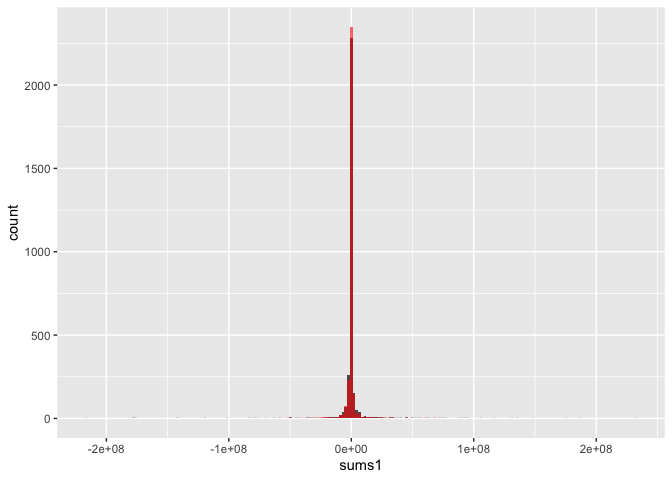

test.RankStatistic.R
================
manncz
2020-11-25

``` r
#source("../../analysis/12-partial-order-helpers.R")
```

Create fake data

``` r
N <- 30
dat <- data.frame(mort = rpois(N, 10),
                  pred = rpois(N, 10),
                  pop = rnorm(N, 100000, 5000),
                  matches = rep(c(1:15), 2),
                  treat = rep(c(1,0), each = 15),
                  m = 1,
                  s = 1,
                  lag = 4)
```

Calculate the residuals and adjusted residual

``` r
dat <- dat %>%
  mutate(r = case_when(is.na(mort) ~ 0,
                       TRUE ~ log(pmax(mort,1))-log(pred))) %>%
  group_by(matches) %>%
  mutate(mean_r = mean(r)) %>%
  ungroup()%>%
  mutate(e = r - mean_r,
         c = as.numeric(is.na(mort)))
```

Calculate the test statistic W using the CM written function.

``` r
(my.calc.stat <- calc_test_stat(dat)$W)
```

    ## [1] 56

The test statistic that we calculate is actually the sum of the ranks
for the treatment group, minus the sum of the ranks for the control
group. Since the `wilcox.test` only calculates the sum of ranks for one
group, we need to apply the function twice, with each treatment group as
the reference group and then subtract the resulting calculated test
statistics.

This is showing that without adjustment or matches, our procedure
calculates the same rank sum test statistic.

``` r
dat$treat<- factor(dat$treat)
(out1 <- wilcox.test(e ~ treat, data = dat))
```

    ## 
    ##  Wilcoxon rank sum test with continuity correction
    ## 
    ## data:  e by treat
    ## W = 84.5, p-value = 0.254
    ## alternative hypothesis: true location shift is not equal to 0

``` r
dat$treat<- relevel(factor(dat$treat), ref = 2)
(out2 <- wilcox.test(e ~ treat, data = dat))
```

    ## 
    ##  Wilcoxon rank sum test with continuity correction
    ## 
    ## data:  e by treat
    ## W = 140.5, p-value = 0.254
    ## alternative hypothesis: true location shift is not equal to 0

``` r
(r.calc.stat <- out2$statistic-out1$statistic)
```

    ##  W 
    ## 56

``` r
my.calc.stat == r.calc.stat
```

    ##    W 
    ## TRUE

The rank sum test statistic, with adjusted outcomes should be the same
test as the signed rank test, in the case of pair matching.

``` r
x <- dat$r[1:15]
y <- dat$r[16:30]

S <- sum(x>y)

(Wprime <- wilcox.test(x, y, paired = T)$statistic)   
```

    ##  V 
    ## 66

``` r
(W <- wilcox.test(e ~ treat, data = dat)$statistic)
```

    ##     W 
    ## 140.5

``` r
2*Wprime - S
```

    ##   V 
    ## 124

## Testing on Full data

Now, we can calculate the test statistics for any combination of
subgroup analyses and any outcome. Here we are looking at the overall
test statistic and “subgroup” test statistic for all cause mortality.
These should be the same at this point because the subgroup vector is 1
for all observations.

``` r
analysis <- "hca"
tstat <- test_stat_wrapper(dat = dat.2014, mort_name = outcome_vars[[analysis]], var_names = var_list[[analysis]],
                           delta = 1, m.dat.list = m.dat.list, form = form,
                           race_analyses = c("Non-Hispanic Black") , subgroup = T, overall = T, alt.r = F)
```

    ## `summarise()` regrouping output by 'FIPS', 'matches', 'treat', 's' (override with `.groups` argument)

    ## [1] "The proportion of counties with zero deaths is: 0.00654878847413229"

    ## `summarise()` regrouping output by 'FIPS', 'matches', 'treat', 's' (override with `.groups` argument)

    ## [1] "The proportion of counties with zero deaths is: 0.00654878847413229"

    ## `summarise()` regrouping output by 'FIPS', 'matches', 'treat', 's' (override with `.groups` argument)

    ## [1] "The proportion of counties with zero deaths is: 0.416256964929531"

First, checking that the subgroup analysis is working as expected

``` r
tstat$overall$W
```

    ## [1] 9170934146

``` r
tstat$subgroup$W
```

    ## [1] 9170934146

Next, I was interested in how much things would change if we use
log(min(mort, 1)) or log(min(mort, min(pred))) to calculate the
residuals (alt.r = T for using the minimum prediction.)

``` r
tstat2 <- test_stat_wrapper(dat = dat.2014, mort_name = outcome_vars[[analysis]], var_names = var_list[[analysis]],
                            delta = .99, m.dat.list = m.dat.list, form = form,
                            race_analyses = c("Non-Hispanic Black"), subgroup = F, overall = T, alt.r = T)
```

    ## `summarise()` regrouping output by 'FIPS', 'matches', 'treat', 's' (override with `.groups` argument)

    ## [1] "The proportion of counties with zero deaths is: 0.00654878847413229"
    ## [1] 0.5404987

    ## `summarise()` regrouping output by 'FIPS', 'matches', 'treat', 's' (override with `.groups` argument)

    ## [1] "The proportion of counties with zero deaths is: 0.416256964929531"
    ## [1] 0.0001981072

Comparing the test statistics and p-values from the two methods of
calculating the residuals, it appears that they differ in a meaningful
way.

``` r
tstat$overall$W
```

    ## [1] 9170934146

``` r
tstat2$overall$W
```

    ## [1] 12863099060

``` r
tstat$overall$pval
```

    ## [1] 0.2225934

``` r
tstat2$overall$pval
```

    ## [1] 0.1889535

``` r
tstat$`Non-Hispanic Black`$W
```

    ## [1] 130521873

``` r
tstat2$`Non-Hispanic Black`$W
```

    ## [1] 691800693

``` r
tstat$`Non-Hispanic Black`$pval
```

    ## [1] 0.06464172

``` r
tstat2$`Non-Hispanic Black`$pval
```

    ## [1] 0.8232128

``` r
check <- data.frame(sums1 = tstat$`Non-Hispanic Black`$Sums, sums2 = tstat2$`Non-Hispanic Black`$Sums,
                    mort = tstat$`Non-Hispanic Black`$mort, pred = tstat$`Non-Hispanic Black`$pred,
                    matches = tstat$`Non-Hispanic Black`$Matches) %>%
  arrange(matches) %>%
  ungroup() %>%
  mutate(resid1 = log(pmax(mort, 1)) - log(pred),
         resid2 = log(pmax(mort, min(pred))) - log(pred))

ggplot(data = check) + geom_histogram(aes(x = sums1), bins = 200) + 
  geom_histogram(aes(x = sums2), bins = 200, alpha = .6, fill = "red")
```

<!-- -->
