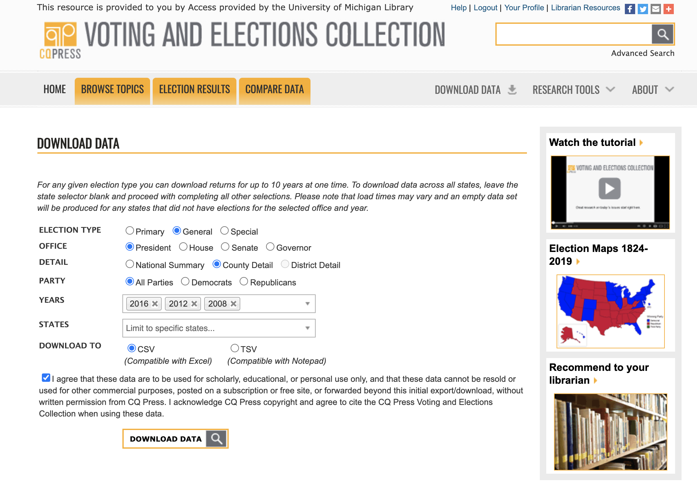
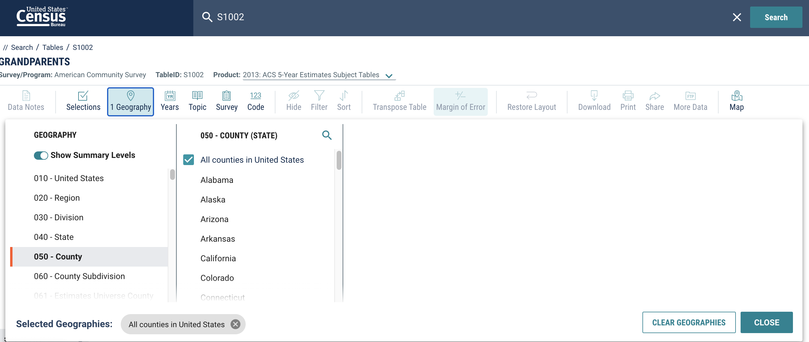

## Data Sources and Notes

## Baseline Variables

All variable descriptions and sources included in the combined baseline dataset can be found in "reference/notes/base_variables.xlsx."

### Partisanship data (data-raw/pres_2008_2016.csv)

Data downloaded from CQ Press Voting and Elections Collection, access through the University of Michigan library (http://library.cqpress.com.proxy.lib.umich.edu/elections/download-data.php).

See screenshot below for download selections:

Notes:
* Alaska data is not reported for counties (but rather for Election districts) so it is excluded.
* A weighted average of District of Columbia data is taken.
* Kalawao county Hawaii is not included in the data.
* Kansas city is reported separately in the election data - it looks like it goes across a couple of counties, but is mainly in Jackson, so I will categorize it there for now.
* In 2016 there is an observation for Milton Georgia, which appears to be a city and not a county and the data is all missing or 0, so it seems reasonable to exclude.
* The "% republican" variable kept is called "% majority" in the data and is the % of votes to the republican candidate out of all votes in the county to the republican and democrat candidates (i.e. excluding other parties). Thus % democrat = 1 - % republican. The information on % republican out of all votes is also available.

Note for later: figure out how to handle Kalawao/Mauii

### Area Health Resources File (data-raw/AHRF2019.asc)

Data and documentation downloaded from the  Health Resources & Services Administration (https://data.hrsa.gov/data/download).

Documentation includes:
* "reference/AHRF 2018-2019 Technical Documentation.xlsx" (variable names with years, original sources, and tape locations)
* "reference/AHRF USER 2018-2019.doc" (notes and detailed explanation of variables)
* "reference/2018-2019_AHRFDUA.doc" (data usage licence)
* "reference/AHRF2018-19.sas" (SAS code that reads in correct records and names columns)

"reference/notes/Variables Used.xlsx" and "Variables Used.docx" include subsets of  "reference/AHRF 2018-2019 Technical Documentation.xlsx" and "reference/AHRF USER 2018-2019.doc" with only the variables pulled for our analysis.

### IHME data (various folders in data-raw)

Data received from collaborator Dr. Lauren Gaydosh, original sources can be found in data dictionaries in the respective data-raw subfolders.

#### Notes on matching county names and FIPS

* The smoking and alcohol consumption data only had county names and no FIPS codes. County names were mostly able to be matched with the county names from the AHRF, although some manual work was also required. The other files had FIPS and any adjustments are noted in comments in the code.
* The data groups adams/boulder county/broomfield county/jefferson county/weld county in Colorado, so this data is considered for each of these counties in the final dataset.
* augusta/waynesboro city, bedford/bedford city, fairfax/fairfax city, prince william/manassas park city, southampton/franklin city in virginia are also grouped
* wade hampton census area in Alaska is now called Kulsivak
* denali borough/yukon-koyukuk census area, hoonah-angoon census area/skagway municipality/yakutat city and borough, ketchikan gateway borough/petersburg census area/prince of wales-hyder census area/wrangell city and borough, adams/boulder county/broomfield county/jefferson county/weld county are grouped (Alaska)

#### Smoking

* Smoking prevalence by gender and year is available.
* I pulled smoking prevalence for both genders combined for 2010-2012.

#### Alcohol consumption

* Any drinking prevalence, heavy drinking prevalence, and binge drinking prevalence in addition to the proportion of drinkers who are heavy drinkers and the proportion of drinkers who are binge drinkers by year and sex are available.
* I pulled age-standardized prevalence of heavy drinking for both sexes combined for 2010-2012.

#### Hypertension

* Total hypertension prevalence (among all respondents, percentage of those who reported systolic BP of at least 140mm HG and/or self-reported taking medication), percentage of respondents who reported being told by a doctor or other healthcare professional that they had hypertension, among prevalent cases, those who report taking prescribed medication, among prevalent cases, the percentage of respondents who reported taking prescribed medication and SBP <140 mm Hg, percentage of respondents who reported being told by a doctor or other healthcare professional that they had hypertension and SBP of 140 mm Hg or higher, and among prevalent cases, the percentage of people who have hypertension and know it by race, gender (there is no combined gender estimate), and year (only 2001 and 2009) are available.
* I pulled the total hypertension prevalence for all races combined for males and females in 2009 .

#### Diabetes

* The proportion of adults age 20+ who report a previous diabetes diagnosis (age-standardized), proportion of adults age 20+ who do not report a previous diabetes diagnosis who have high FPG/A1C* (age-standardized), proportion of adults age 20+ who report a previous diabetes diagnosis and/or have high FPG/A1C* (age-standardized), proportion of adults age 20+ with a previous diabetes diagnosis and/or high FPG/A1C* who have received a diagnosis (age-standardized), and proportion of adults age 20+ with a previous diabetes diagnosis and/or high FGP/A1C* who currently do not have high FPG/A1C* (age-standardized) by sex and year are available.
* I pulled age-standardized prevalence of of adults age 20+ who report a previous diabetes diagnosis and/or have high FPG/A1C* ("Total" tab) for both sexes combined for 2010-2012.

#### Obesity / Physical Activity
* Prevalence of any physical activity, sufficient physical activity, and obesity by year (2001-2011) and gender (there is no combined gender estimate) are available.
* I pulled prevalence of obesity and sufficient physical activity males and females in 2011.

### American Community Survey (data-raw/ACSST5Y2013.S1002_data_with_overlays_2020-06-17T162523.csv)

Data from the ACS table S1002 downloaded were from (https://data.census.gov/cedsci/table?q=S1002&g=0100000US.050000&tid=ACSST1Y2013.S1002&hidePreview=true). The 5 year data is downloaded because only data for counties above a certain size are included in the 1-year data. Thus, this represents the average from 2009-2013.

See screenshot below for download selections:

Documentation includes:

* "reference/ACSST5Y2013.S1002_metadata_2020-06-17T162523.csv" (list of variables)
*  "ACSST5Y2013.S1002_table_title_2020-06-17T162523.txt" (Notes from the ACS)

"Existence of a Grandparent Living with a Grandchild in the Household – This was
determined by a “Yes” answer to the question, “Does this person have any of his/her own
grandchildren under the age of 18 living in this house or apartment?” This question was
asked of people 15 years of age and over. Because of the low numbers of persons under 30
years old living with their grandchildren, data were only tabulated for people 30 and over."

* Total number of households, number of households with grandparents living with grandchildren, and "percent imputed" grandparents living with grandchildren are pulled. Many other variables are available split by age and gender.

Notes: I don't fully understand what the variables mean. Dividing the # of households with grandparents living with a grandchild is a very different value than the variable % of grandparents living with grandchildren.

## Treatment Variable

### Medicaid Expansion (data-raw/expansion-status-interactive-map_1.2.19.csv)

Data downloaded from the Kaiser Family Foundation "Status of State Medicaid Expansion Decisions: Interactive Map" (https://www.kff.org/medicaid/issue-brief/status-of-state-medicaid-expansion-decisions-interactive-map/).

The data contains the date of adopting expansion and the date that expansion actually came into effect and more detailed information about later adopting states can be found at the website.

## Other

### County adjacency
County adjacency (data-raw/county_adjacency2010.csv) is downloaded from the National Bureau of Economic Research (https://data.nber.org/data/county-adjacency.html). It lists which counties are adjacent to each county in the US with each row being a county pair that are adjacent.

### State county_adjacency2010
State adjacency (data-raw/neighbors-states.csv) is downloaded from a personal GitHub account [here](https://github.com/ubikuity/List-of-neighboring-states-for-each-US-state/blob/master/neighbors-states.csv). Like the county adjacency, it lists which state are adjacent to each state in the US with each row being a state pair that are adjacent.

### Land area
County land area (data-raw/land_area_cdc.csv) is downloaded from the Sage Stats database (http://data.sagepub.com.proxy.lib.umich.edu/sagestats/document.php?id=7604). Access is from the University of Michigan Library. The original data source is the CDC, although this data is not accessible through the CDC at this time. The intention is to use this to calculate the population density, which is relevant for COVID.

### Covid data Repository

https://github.com/Yu-Group/covid19-severity-prediction/blob/master/data/readme.md

## Covid mortality

### USA Facts

Daily (cumulative) mortality counts by county are available through USA facts (https://usafacts.org/visualizations/coronavirus-covid-19-spread-map/). They note that their data collection process involves both scraping and manual entry. The data is taken from individual state and county websites and reports. We would need to chose a date from which to select this data (or promise to update as time goes on). USA facts provides information about their data collection here (https://usafacts.org/articles/detailed-methodology-covid-19-data/). The CDC is actually republishing the USA Facts data on the CDC webite, separately from the National Center for Health Statistics (NCHS) data (https://www.cdc.gov/coronavirus/2019-ncov/cases-updates/county-map.html). The CDC notes that the methods that NCHS uses differ from county or state level counties in some cases, which is why the data may not match (see https://www.cdc.gov/nchs/nvss/vsrr/covid19/tech_notes.htm).

Some states have deaths reported that were not able to be allocated to a specific county. In particular, Georgia, Maryland, Michigan, New York, Rhode Island all have more than 50 unallocated deaths. Rhode Island is the most concerning since USA Facts notes that Rhode Island does not report deaths by city/county, but rather that deaths for certain nursing homes are reported, and those deaths are assigned to counties. Thus, around 1/3 of deaths in RI are "unallocated." Some possible ways to deal with this are to allocate those deaths to Rhode Island counties according to the proportion of deaths in each county (or the population) or to exclude Rhode Island from our analysis.

### John's Hopkin's University

The Center for Systems Science and Engineering (CSSE) at Johns Hopkins University is maintaining a COVID-19 Data Repository which is also updated daily (https://github.com/CSSEGISandData/COVID-19#covid-19-data-repository-by-the-center-for-systems-science-and-engineering-csse-at-johns-hopkins-university). It appears that they are using similar methodology to USA Facts, by pulling data from county and state reports, however the values for some counties don't align and they treat New York City differently and don't infer any data for Rhode Island. The data is maintained on GitHub and appears to be crowdsourcing data validity checks and updates. I am more inclined to trust the USA Facts data, especially since the CDC is themselves reporting the USA Facts counts.

### CDC National Center for Health Statistics (NCHS)

The official CDC county level data comes form the NCHS, which would align with the mortality data used already in this project (https://data.cdc.gov/NCHS/Provisional-COVID-19-Death-Counts-in-the-United-St/kn79-hsxy). County-level death counts are only reported for counties with more than 10 deaths reported, according to the NCHS standards. NCHS reviews death certificates and reports that they tend to have a two week lag behind other sources. As of 7/2/2020 only 653 counties are reported (which is about 20% of counties in the US).

As a note the data included on Rhode Island counties sheds some light on how the US Facts data is undercounting RI deaths.

Comparing the USA Facts and NCHS data, there are 163 counties in the USA Facts data that have 10 or more deaths recorded (a mean of 16, max of 69, with most under 30) that are not yet included in the NCHS data. There are also 41 counties that appear in the NCHS data with 10 or more deaths that have less than 10 deaths recorded in the US Facts data. For counties that do match, the values in the US Facts and CDC data tend to differ by 10% of the NCHS death count (median). The counts are only the same for 3% of the counties reported in NCHS. The counts are greater in the US Facts data for 60% and less in the US facts data for 37% of the counties reported in NCHS.
